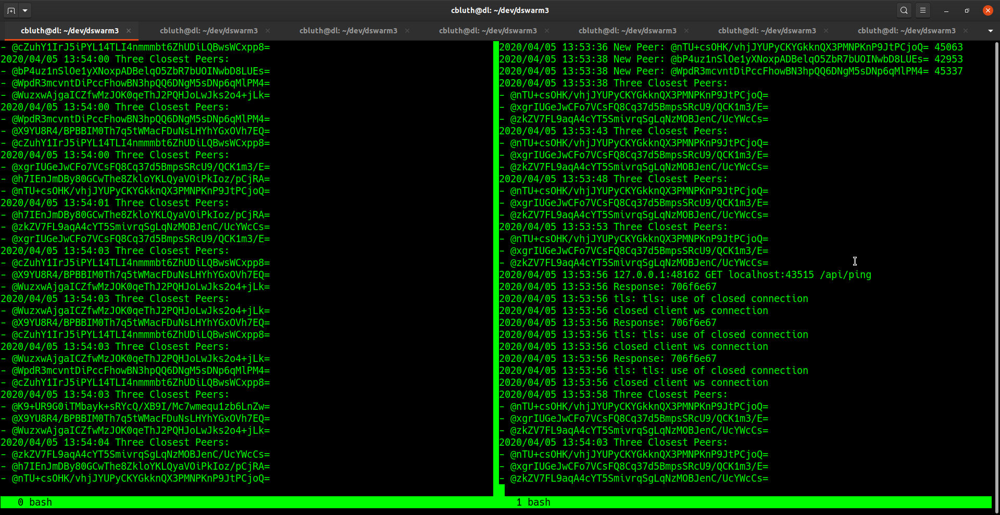

# DHT Swarm

this is a practice in UDP Multicasting, and DHT experimentation in a localhost. 
the idea is to run as many instances of this daemon as you want, and all instances will find eachother via udp multicast and build a dht network.
each peer of the network generates an ed25519 keypair, and binds to a random port.
the port is an http service that takes requests at these endpoints:
- /dht
- /api

the /dht endpoint serves websocket rpc requests

the /api endpoint serves https curl requests.
right now the only implemented rpc call

its all a work-in-progress. more work to be added soon.

## swarm

as each instance of this is executed on the network (or on the same computer), every 5 seconds the instance broadcasts a UDP packet containing a newly generated public key, a random service port, and consequentially its own ip address from the IP packet.
each time an instance receives a UDP multicast packet, it checks the new peer's public key against a map, if its a newly found peer, it will log it to stdout, and add it to the map in memory.
the bucket is printed every 5 seconds

## demo

1. `git clone` this project, or download here: [master.zip](https://github.com/distributed-mind/dswarm/archive/master.zip)
2. use `./build.sh` to build in docker, or just use `go build`
3. open two terminal windows:
  - in one terminal, run `./demo.sh` to spawn ten instances
  - in another terminal curl the api to perform an RPC ping
  ```
  curl -kvs https://localhost:port/api/ping
  ```
^^^ this will tell the peer to perform n RPC ping to the top three closest peers in the bucket.




## note
some things to note:
- all peers use 32 byte length keys for node-IDs, dht distance metrics, and i plan on using sha256 hashes for the dht keys, this parts from the kademlia standard
- all peer dht connections use a self-signed certificate, i dunno, for fun
- only the "ping" rpc method is implemented right now, more to come
- secret handshake is used to ensure each peer is connecting to the right peerID (public-key validation)
- this project is intended to be a local test-bed for playing with DHTs, hence the api endpoint
